# REVIEW FEEDBACK FRONTEND BACKEND

1. A dedicated issue or ticket with a summary of the requirements, outcomes, and technical aspects as well as a pull request should be created.
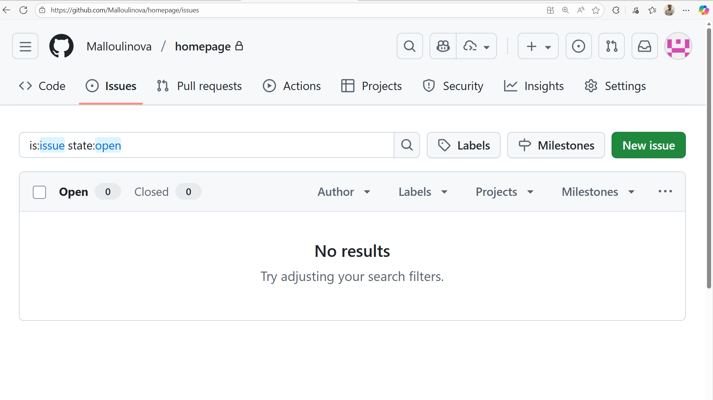

> Done

2. Can we remove the following intermediate step in meeting scheduling?
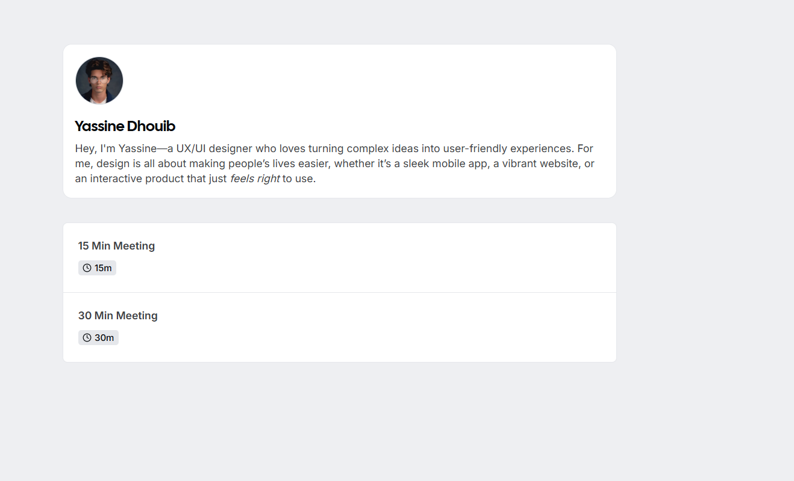

> Wassim should provide his personalized url to zoho booking.

- Can we add the meeting duration selection to the following screen?
- Can we change the google meet by Zoho meeting?
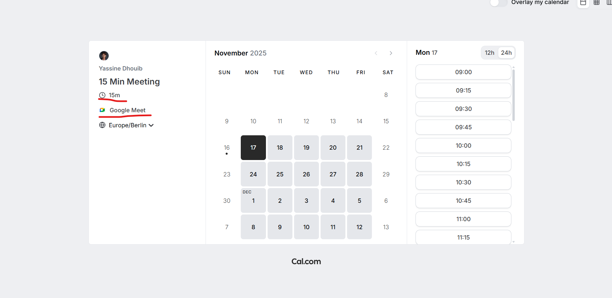

 In progress

3. Case studies are not loaded properly. The logo is not visible.
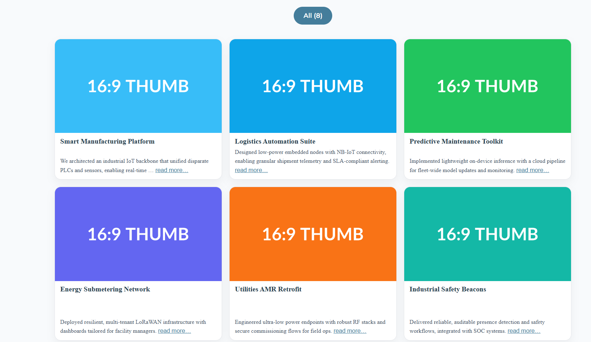
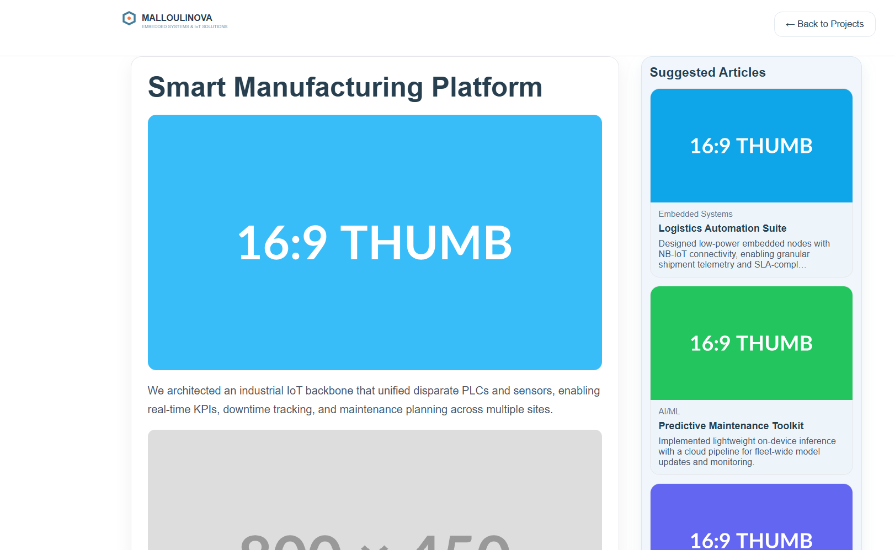

> Done

4. We should use customized icons and graphics.
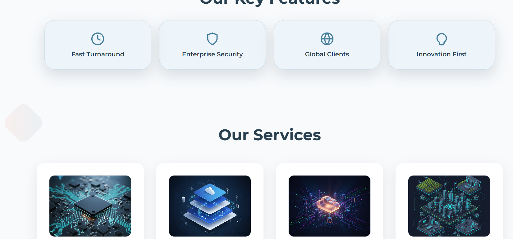

> In progress

5. We should replace the example partner by our actual professional and academic partners. https://stackforce.com/en, https://isb.tn/, https://www.linkedin.com/company/centre-sup%C3%A9rieur-de-formation-csf/?originalSubdomain=tn
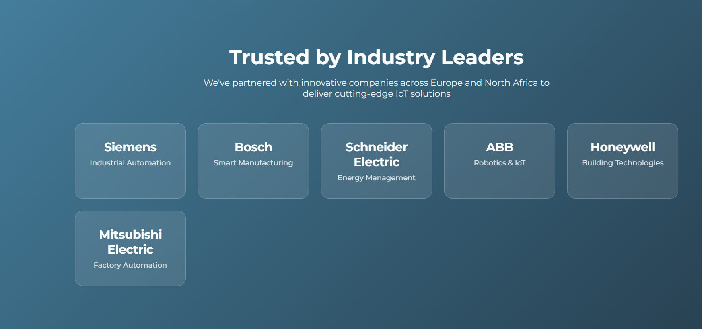

> Done

6. THe bios for Marwa (head of finance and HR) https://www.linkedin.com/in/marwa-maalej-711582133/ and Sofien (software developer) https://www.linkedin.com/in/soufien-kallel/ are missing.
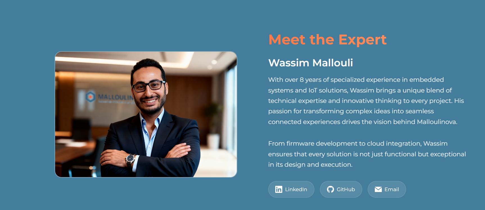

Linkedin and email of the team member should be used instead of the company generic email, github and linkedin.

>Done

7. Wrong contact mail in the footer and the chatbot. The chat is not working.
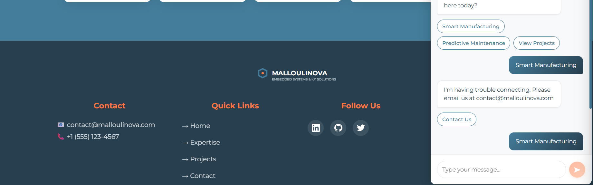

> Done

8. Connect with wassin can be removed. Legal section should be corrected-
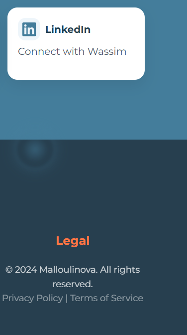

> Done

9. The page is not nicely resposive on very large screens. The content is centred and not stretched to use the full screen width.

> In progress

10. Logo appears two times in the dashboard.
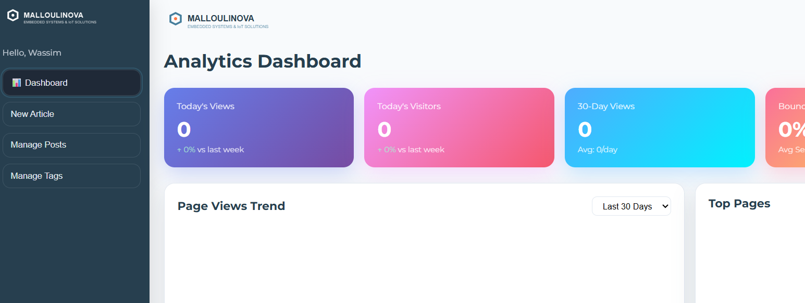

>Done

11. MALLOULINOVA should be attached and uppercase everywhere.
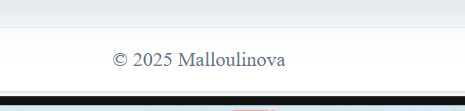

> In progress

12. For consistency rename the button to "Manage articales" insttead of "Manage posts"
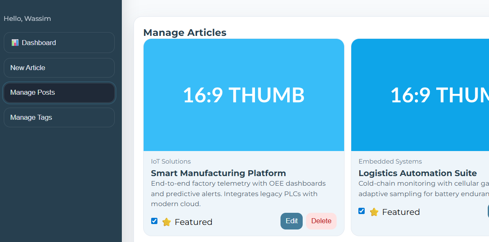

>Done

13. Can we add partners, team members, FAQs, features, sevices and technologies and protocols manageent to the dashboard?

> Done

14. Can we make the about us, technologies and protocols and partners sections automatically scrollable to the left.

> The partners section is still not scrollable to the left.

15. Return to top button is missing.

> Done

16. Can we add slow-moving gradients to the hero section background?

> In progress
